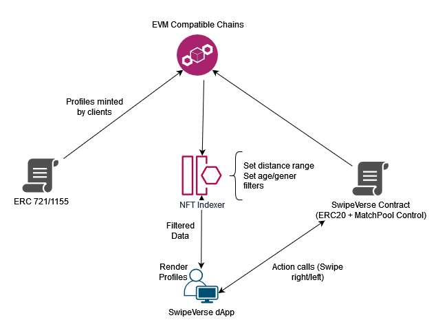

# SwipeVerse

SwipeVerse, a web3 alternative to web2 social/dating applications.

## Deployments by EVM Chain
<table>
<tr>
<th>Network</th>
<th>SwipeVerseCaptain</th>
<th>SwipeVX</th>
</tr>
<tr><td>Ethereum</td>
<td>contract_address</td>
<td>contract_address</td>
</tr>
<tr><td>Polygon</td>
<td>contract_address</td>
<td>contract_address</td>
</tr>

## Diagram

## License